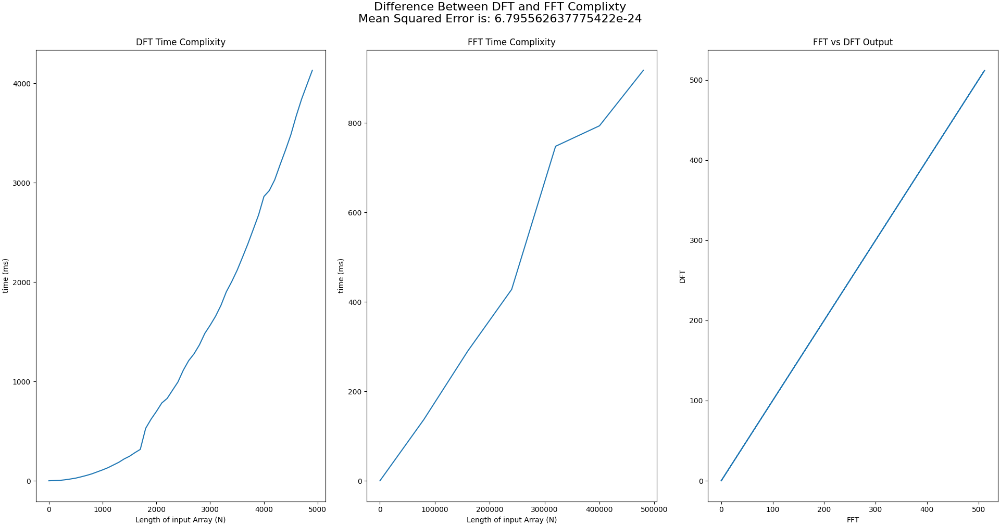

# kiss-ft-and-fft



## Table of Contents

-   [About the Project](#about-the-project)
-   [Toolbox](#toolbox)
-   [Setting Up the Environment](#setting-up-the-environment)
-   [Our Team](#our-team)
-   [Acknowledgements](#acknowledgements)
-   [About](#about)

## About the Project

This is a simple console application implementing the Fourier Transform Algorithm and the Fast Fourier Transform Algorithm using C++ Language as a shared library passed to python.

## Toolbox

-   Python
    -   Matplotlib
-   C++

## Setting Up the Environment

1. Clone the repo
    - HTTPS
        ```sh
        git clone https://github.com/RamadanIbrahem98/kiss-ft-and-fft.git
        ```
    - SSH
        ```sh
        git clone git@github.com:RamadanIbrahem98/kiss-ft-and-fft.git
        ```
1. Create a Virtual Environment (Optional)
    ```sh
    python -m venv .env
    ```
1. Activate the virtual environment

    - using CMD
        ```sh
        .\.env\Scripts\activate
        ```
    - using PowerShell
        ```sh
        .\.env\Scripts\Activate.ps1
        ```
    - using Bash
        ```sh
        source .env/bin/activate
        ```

1. Install the requirements and dependancies
    ```sh
    pip install -r requirements.txt
    ```
1. Install Mingwx64 on your machine. (i.e. using chocolatey)
    - Install Chocolatey Following the instruction here:
        https://chocolatey.org/install
    - Install Mingwx64 using chocolatey command line tools
        https://community.chocolatey.org/packages/mingw
    - Make Sure that the chocolatey bin folder is prioritized first at the PATH environment

1. Compile the C++ file into the shared library (.so file)

    ```sh
    g++ -shared -fPIC -o library.so main.cpp
    ```

1. Run the application
    ```sh
    python main.py
    ```

## Our Team

-   Ramadan Ibrahem - [![linkedin-shield]](https://www.linkedin.com/in/ramadanibrahem/)
-   Muhammad Seyam - [![linkedin-shield]](https://www.linkedin.com/in/mohamed-seyam-91b3b81b7/)
-   Muhammad Abd-ElAziz - [![linkedin-shield]](https://www.linkedin.com/in/mohamed-ahmed-abdelaziz)
-   Yousef Samir - [![linkedin-shield]](https://www.linkedin.com/in/youssef-samir-b24848191)

## About

This project is a part of the SBE309 curriculum (Biological Signal Processing) in the [Systems and Biomedical Engineering Department - Cairo University](http://bmes.cufe.edu.eg/)\
Dr.Tamer Ahmed\
TA. Christina Adly

[linkedin-shield]: https://img.shields.io/badge/-LinkedIn-black.svg?style=flat-square&logo=linkedin&colorB=555